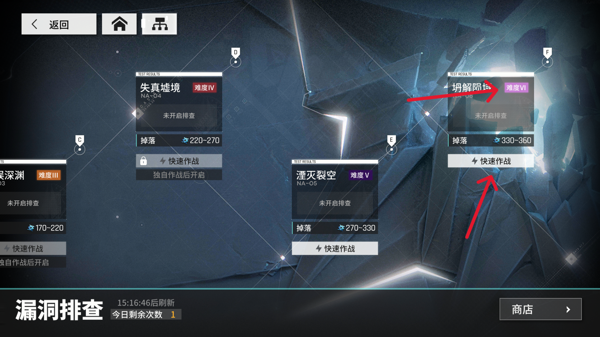
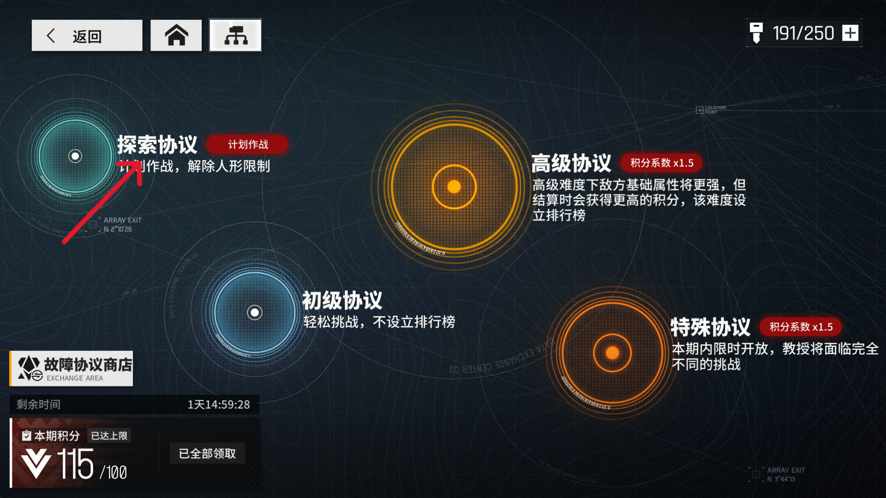

<!-- markdownlint-disable MD033 MD041 -->

  

# MaaGFNuralCloud

本项目为基于 [MaaFramework](https://github.com/MaaXYZ/MaaFramework) 进行开发的云图计划自动化小助手。

>本项目完全免费，如您付费购买请立即退款并举报。

## 联系方式

暂无

## 使用说明

> [!NOTE]  
> 测试都是在 Windows 系统上测试的，因此建议使用 Windows 系统运行。  
> 开发基于 MuMu12 模拟器测试，因此推荐使用 MuMu12 运行游戏。
> 项目初期测试并不完善，如您在使用过程中有任何问题请在我添加联系方式后联系我。

1. 推荐使用MuMu模拟器12运行游戏，[模拟器支持情况](https://maa.plus/docs/zh-cn/manual/device/windows.html)请查看官方文档。
2. 模拟器建议设置为`1920*1080 (1080P)`的分辨率。

## 快速使用

1. 从[Releases](https://github.com/PinkMMF/MaaGFNeuralCloud/releases)界面下载符合自身条件的压缩包，一般为MaaGFNeuralCloud-win-x86_64-v1.x.x.zip
2. 解压下载好的压缩包后双击或右键运行解压目录下的 `MaaGFNeuralCloud.exe` 文件。
3. 阅读功能说明后进行配置即可

## 功能说明

请完整阅读完本项后再使用本自动化小助手。

### 启动及关闭游戏

目前仅适配官服。

### 宿舍收取

请确保至少添加了5位好友。

### 加工厂领取及生产

该功能只会生产上回订单，请自己先生产一次自己需要的物资。

### 漏洞排查

只适配到最高难度，请解锁最高难度快速作战后再使用此功能，如下图所示：

### 故障协议

该功能仅会使用探索协议，暂不支持自选编队，仅使用上一次作战时的编队，因此在使用该功能前请确保使用自己主力编队通关过一次。

### 碎片搜索

使用该功能前确保碎片搜索中关注且仅关注三个人形,如下图所示：

### 商店收取

在选择兑换心智碎片时暂不支持兑换指定人形的心智碎片。

### 资源采集及算法采集

作战次数待优化，目前不影响正常使用。

### 收集任务奖励

因每日完成任务会送体力，建议一前一后设置两次该任务

## 已有功能

* [x] 启动游戏

* [x] 宿舍收取

* [x] 绿洲收取

* [x] 加工厂领取及生产

* [x] 漏洞排查

* [x] 故障协议

* [x] 碎片搜索

* [x] 每日双倍

* [x] 商店收取
  * [x] 故障协议区
  * [x] 漏洞排查区

* [x] 资源采集

* [x] 算法采集

* [x] 收集任务奖励

* [x] 基础检索

* [x] 关闭游戏

### 待开发功能

## 鸣谢

本项目由 **[MaaFramework](https://github.com/MaaXYZ/MaaFramework)** 强力驱动！

感谢以下开发者对本项目作出的贡献:

